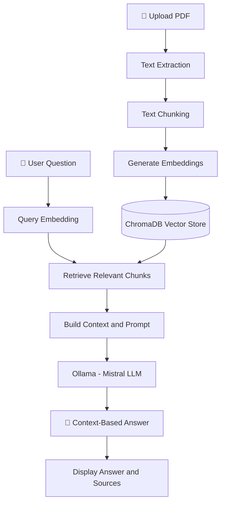

# 🧠 DocuMind AI — Offline PDF RAG Chatbot

<p align="center">
  <b>Chat with your documents. Get AI-powered answers. Keep processing local.</b>
</p>

<p align="center">
  
  
  
  
  
</p>

---

## 📌 About the Project

**DocuMind AI** is an AI-powered PDF question-answering application built using Retrieval-Augmented Generation (RAG).

It allows users to upload PDF documents, ask questions about their content, and receive context-aware answers generated using a locally running Large Language Model (LLM).

The application retrieves relevant information from uploaded documents and uses it to generate answers instead of relying only on the LLM's pre-trained knowledge.

DocuMind AI is designed to run locally using **Ollama, Mistral, Sentence Transformers, and ChromaDB**.

🎯 **Goal:** Make it easier to understand, search, and interact with documents using AI while keeping document processing and LLM inference on the user's machine.

> 🚧 **Project Status:** Currently in the development and team-testing phase. The application has not been deployed publicly yet.

---

## ✨ Features

| Feature | Description |
|---|---|
| 📄 PDF Upload | Upload PDF documents for question answering |
| 📝 Text Extraction | Extract text from PDF documents |
| ✂️ Text Chunking | Split text into smaller chunks |
| 🧠 Embeddings | Convert text chunks into vector representations |
| 🔍 Semantic Search | Retrieve relevant chunks for a user query |
| 🗄️ ChromaDB | Store and retrieve embeddings locally |
| 🤖 Local LLM | Generate answers using Mistral through Ollama |
| 📚 Context-Based Answers | Generate answers using retrieved document context |
| 💬 Multiple Chats | Maintain separate conversations |
| 🕘 Chat History | Save and revisit previous conversations |
| 🔒 Local Processing | Run the application with locally stored models |

---

## 🖥️ Tech Stack

| Technology | Purpose |
|---|---|
| Python | Core programming language |
| Streamlit | Web application interface |
| LangChain | LLM integration and RAG workflow |
| Ollama | Run the LLM locally |
| Mistral | Answer generation |
| Sentence Transformers | Generate text embeddings |
| all-MiniLM-L6-v2 | Embedding model |
| ChromaDB | Vector database |
| PyPDF | PDF text extraction |

---

## 🏗️ System Architecture



### 🔄 How It Works

1. The user uploads a PDF document.
2. The application extracts text and splits it into chunks.
3. Sentence Transformers converts chunks into embeddings.
4. ChromaDB stores the embeddings and associated document data.
5. The user asks a question related to the document.
6. The query is embedded and used to retrieve relevant chunks.
7. The retrieved context is passed to Mistral through Ollama.
8. The generated answer is displayed in the Streamlit interface.

---

## 📂 Project Structure

```text
DocuMind-AI/
│
├── app.py
├── src/
│   ├── __init__.py
│   ├── data_ingestion.py
│   └── rag.py
│
├── data/
│   ├── uploads/              # Local PDF uploads
│   ├── vector_store/         # Local ChromaDB persistence
│   └── chat_history.json     # Local chat history
│
├── models/
│   └── all-MiniLM-L6-v2/     # Local embedding model
│
├── download_model.py         # Model download script (if included)
├── requirements.txt
├── pyproject.toml
├── uv.lock
├── .python-version
├── .gitignore
└── README.md
```

> 📌 The `models/`, uploaded PDFs, vector database, and chat history are local runtime data. They may not be included in the GitHub repository. The application setup should create or populate the required directories.

---

## ⚙️ Installation & Setup

Follow these steps to run DocuMind AI on your local machine.

### ✅ Prerequisites

- Python installed
- Git installed
- Ollama installed
- Mistral model downloaded through Ollama
- Required Python dependencies
- Embedding model available locally

### 1️⃣ Clone the Repository

```bash
git clone https://github.com/Shrirang45/DocuMind-AI.git
```

Navigate to the project folder:

```bash
cd DocuMind-AI
```

### 2️⃣ Create a Virtual Environment

```bash
python -m venv .venv
```

Activate it on Windows PowerShell:

```powershell
.venv\Scripts\Activate.ps1
```

If PowerShell blocks activation, use Command Prompt:

```cmd
.venv\Scripts\activate.bat
```

### 3️⃣ Install Dependencies

```bash
pip install -r requirements.txt
```

Run this command from the project root.

### 4️⃣ Install and Configure Ollama

Download Ollama:

👉 https://ollama.com/

Download the Mistral model:

```bash
ollama pull mistral
```

Verify that the model is available:

```bash
ollama list
```

Make sure Ollama is running before using the application.

### 5️⃣ Download the Embedding Model

DocuMind AI uses the `all-MiniLM-L6-v2` Sentence Transformers model.

If `download_model.py` is included and configured, run:

```bash
python download_model.py
```

Ensure the model is saved at the local path expected by the application, for example:

```text
models/all-MiniLM-L6-v2/
```

If the download script is not included, follow the model download instructions or configure the model-loading code accordingly.

> ⚠️ The initial model download requires internet access unless the model files are already available locally.

### 6️⃣ Run the Application

```bash
streamlit run app.py
```

Open the local URL displayed in the terminal, usually:

👉 http://localhost:8501

---

## 📖 How to Use DocuMind AI

1. 🚀 Launch the application.
2. 📄 Upload a PDF document.
3. ⏳ Wait for document processing to complete.
4. 💬 Enter a question related to the PDF.
5. 🔍 The system retrieves relevant chunks from ChromaDB.
6. 🤖 Mistral generates an answer using the retrieved context.
7. 📚 Review the answer and available source references.

---

## 🗄️ Vector Database — ChromaDB

DocuMind AI uses **ChromaDB** as its local vector database.

### What does it store?

- Document chunk embeddings
- Text chunks and associated metadata
- Information needed for semantic retrieval

### Where is it stored?

```text
data/vector_store/
```

When PDFs are ingested, their processed chunks and embeddings are stored in the local ChromaDB persistence directory.

The actual database files are excluded from GitHub because they are generated locally and can be recreated by ingesting documents.

📌 ChromaDB is a local vector store in this setup, not a cloud-hosted database.

---

## 🔐 Privacy & Local Processing

DocuMind AI is designed to run locally.

- PDF processing is performed on the local machine.
- Embeddings are generated using the local Sentence Transformers model.
- Mistral inference is performed through Ollama.
- ChromaDB stores vectors locally.

The embedding model, uploaded PDFs, vector database, and chat history do not need to be committed to GitHub.

> Local processing helps avoid sending document content to a hosted LLM API in this workflow. However, downloading dependencies or models requires internet access, and privacy also depends on the user's machine and configuration.

---

## 🧪 Team Testing Checklist

The project is currently being verified by team members before deployment.

- [ ] Clone the repository on a fresh machine
- [ ] Install dependencies successfully
- [ ] Download and load the embedding model
- [ ] Run Ollama with Mistral
- [ ] Launch the Streamlit application
- [ ] Upload and process a PDF
- [ ] Test document-based question answering
- [ ] Verify retrieved sources
- [ ] Test multiple chats and saved chat history
- [ ] Test navigation while an answer is generating
- [ ] Report bugs and verify fixes

---

## 🛠️ Troubleshooting

<details>
<summary>❌ Streamlit command not found</summary>

Activate your virtual environment and install the project dependencies:

```bash
pip install -r requirements.txt
```

</details>

<details>
<summary>❌ Ollama or Mistral connection error</summary>

Check whether Ollama is installed and running:

```bash
ollama list
```

If Mistral is missing:

```bash
ollama pull mistral
```

</details>

<details>
<summary>❌ Embedding model not found</summary>

Verify that the model exists at the path expected by the application.

If the project includes a model download script, run it and confirm the model files are present.

</details>

<details>
<summary>❌ No relevant context found</summary>

- Make sure a PDF has been uploaded.
- Confirm document ingestion completed successfully.
- Check that the vector store contains document chunks.
- Try asking a more specific question based on the PDF.

</details>

---

## 👨‍💻 Contributors

**Shrirang Ambure** — Project Developer

GitHub: [@Shrirang45](https://github.com/Shrirang45)

Repository: [DocuMind-AI](https://github.com/Shrirang45/DocuMind-AI)

---

<p align="center">
  ⭐ If you find this project interesting, consider starring the repository!
</p>